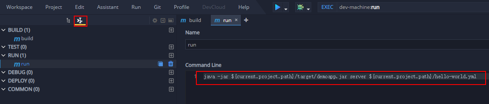
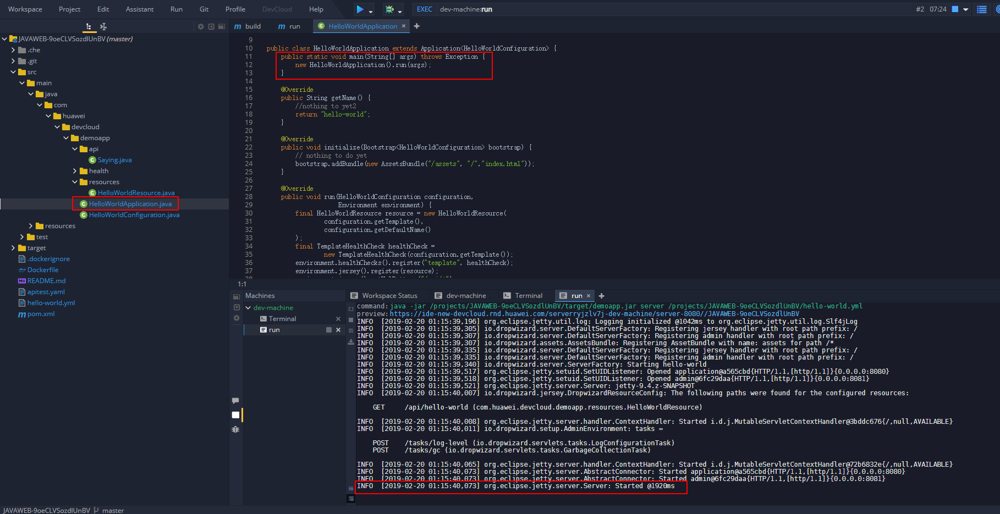

# Java Demo 应用

此样例仓库主要用于展示如何使用DevCloud的服务进行云上构建，并通过流水线拉通部署。

## 基本信息

+ 开发语言：**Java**
+ 模板简介：基于Spring boot的Java Web工程
+ 基本功能：提供给开发者开发Java Web应用的基础脚手架代码

## 如何构建?

### 环境依赖

构建依赖
* JDK 8 (OpenJDK is fine) as SDK
* **Maven 3.3** 构建工具

### 如何下载代码

在环境克隆代码
以下工具需要安装好
* [Maven 3.3](https://maven.apache.org/) 
* [A Maven + JDK Docker image](https://hub.docker.com/_/maven/)

### 构建过程

在仓库根目录

* 执行如下操作
```bash
mvn clean install
```
* 编译:
```bash
mvn clean compile
```
* 执行单元测试用例:
```bash
mvn test
```
* 执行集成测试用例 :
```bash
mvn verify
```

* 打包:
```bash
mvn package
```

* 安装到本地Maven仓库:
```bash
mvn install
```

## 构建任务

* Maven构建


* 上传软件包到软件发布库


* 构建结果


## 如何执行 ?

### 本地执行

 [DropWizard框架](http://www.dropwizard.io/1.0.0/docs/) 生成的应用是一个独立的程序.

执行如下命令拉起应用:

```bash
java -jar ./target/demoapp.jar server ./hello-world.yml
```

通过地址 http://localhost:8080/ 访问

### Docker 执行

构建docker镜像

* 仓库在根目录下有一个`Dockerfile`
* 第一步执行docker build生成镜像:
```bash
docker build -t dw-demo-app:latest ./
```
* 运行镜像(随机端口)
```bash
CID=$(docker run -d -P dw-demo-app:latest)
```
* 查询端口
```bash
docker port ${CID} 8080
```
例如: 0.0.0.0:**37567**

* 则通过 http://{DOCKER SERVICE IP}:**37567**访问

* 停止和清理应用:
```bash
docker stop ${CID} && docker rm -v ${CID}
```

## 流水线相关

- 是否支持自动创建流水线：**支持**

- 流水线配置结构

> 开始阶段
+ 源码仓库

> 编译阶段
+ 构建任务
+ 代码检查任务

> 部署阶段
+ 部署任务
+ 接口测试任务

## CloudIDE相关

- 是否支持在CloudIDE导入：**支持**

- CloudIDE中配置的构建和启动命令

**配置构建命令**

```shell
mvn clean install -f ${current.project.path}
```


**配置启动命令**

```shell
java -jar ${current.project.path}/target/demoapp.jar server ${current.project.path}/hello-world.yml
```




- 在CloudIDE中成功运行


